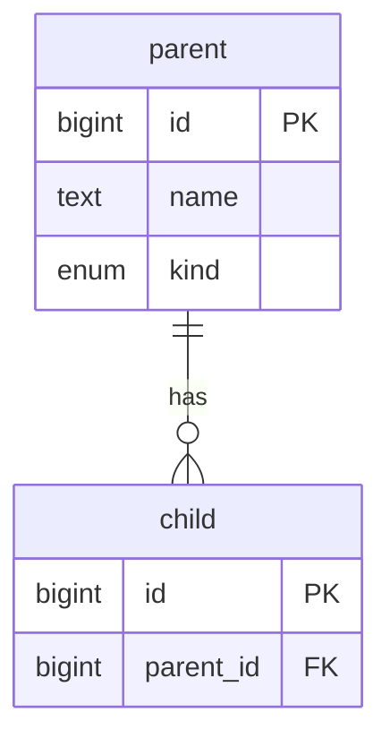

<!-- Set the issue TYPE (not a label) to **Task** — a spec-first schema-design item has no UI component.
     (There is no `enhancement` label in this repo.) -->

<!-- THE LINE BELOW IS PROSE — IT CREATES NOTHING. "Part of mark-my-work/mmw#91" does not make this a sub-issue of mark-my-work/mmw#91, and
     "Depends on: mark-my-work/mmw#537" does not block anything. Once the issue is open, set the real relationships in its
     sidebar — a sub-issue link to the epic, and a blocked-by entry per dependency; only those drive the
     epic's checklist and the blocked indicators. Check each blocker is still OPEN and genuinely delivers
     what you are waiting on. Keep the prose line as well — it is what makes the issue readable on its
     own. -->

Part of #<epic> · Depends on: #<a>, #<b> · Design: <link to the design document>

## Overview

<!-- ≤2-3 sentences: what entity family is modeled, the spec basis (glossary / § refs), and the scope
     boundary — what is out of scope or owned by a sibling issue/epic. -->

## Entity model

<!-- The ERD (GitHub renders Mermaid). Show only this issue's entities; reference existing/other-app
     entities lightly. PK/FK markers; enum/json/bigint/text/etc. as attribute types. -->

<!-- One subsection PER ENTITY below. For each: a one-line business purpose, then EVERY attribute
     (not only the key ones) with its type and the business reason it exists. A bulleted list is fine
     instead of the table. -->

### `parent`

**Business purpose:** <!-- ≤1 sentence: what real-world thing this represents / why it exists. -->

| Attribute | Type | Business reason |
|---|---|---|
| `id` | bigint PK | Surrogate primary key. |
| `name` | text | … |
| `kind` | enum (`a \| b`) | … |

### `child`

**Business purpose:** …

| Attribute | Type | Business reason |
|---|---|---|
| `id` | bigint PK | Surrogate primary key. |
| `parent_id` | bigint FK → `parent` | … |

## Decisions

<!-- The resolved, load-bearing modeling choices, each with a one-line spec-first rationale (and why over
     the alternatives). e.g. polymorphism shape, self-ref vs separate tables, ownership, app placement. -->

1. …
2. …

## Constraints

<!-- Split per CLAUDE.md "DB triggers/constraints enforce DATA SELF-CONSISTENCY, NOT business policy". -->

- **DB (self-consistency):** references resolve / don't cross entities or form cycles; mutually-exclusive
  representations stay exclusive; a row's columns match its discriminator; uniqueness; native-enum checks.
- **App policy (not the DB):** authorization / ownership / business rules (which leave the data
  self-consistent when violated) — located in the service/serializer layer.
- **Enums:** native Postgres enums get a **frozen value snapshot in the initial migration** + the
  `makemigrations --check` guard (the mark-my-work/mmw#38 and mark-my-work/mmw#53 pattern).

## Implementation Notes

Advisory; the plan may adopt, improve, or reject any of it.

<!-- Optional, ADVISORY (issue mark-my-work/mmw#418): the BINDING design of a schema issue is the Entity model + Decisions
     + Constraints above; this section is suggested HOW the plan may improve on or reject — model
     conventions (schema-qualified db_table; TextField + choices; native enums; null=True, blank=True for
     optional strings; no created/updated unless justified), patterns to reuse (e.g. mark-my-work/mmw#53), the owning
     Django app, and any cross-stack mirror/contract test. Delete if unused. -->

## Acceptance

- [ ] Models + migration created (schema-qualified `db_table`; conventions followed).
- [ ] Native enums created with a frozen snapshot + `makemigrations --check` guard (if any).
- [ ] DB self-consistency constraints enforced (CHECK / trigger) with tests on the INSERT and UPDATE paths.
- [ ] App-layer business rules located per CLAUDE.md (not in the DB), or explicitly deferred.
- [ ] Cross-stack mirror + contract test (if the model is mirrored to the frontend).
- [ ] Tests + lint pass.

## Open / build-time decisions

<!-- Optional: deferred field-level questions to resolve during build. Delete if none. -->
- [ ] …
